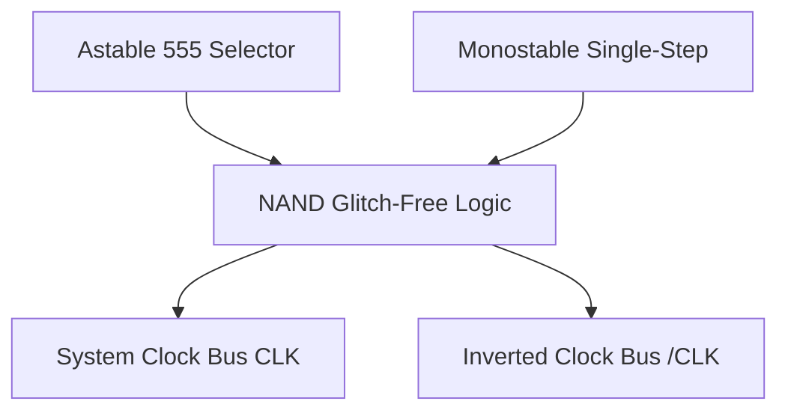

# Module 01: The Clock Module (System Heartbeat)

The clock module provides the system synchronization signals for the entire microcomputer. Instead of just a static oscillator, I designed an adjustable heartbeat with three switchable modes: **Astable** (continuous free-running), **Monostable** (manual single-step pulsing for debugging), and **Bistable** (manual state latches).

---

## 1. System Architecture & Flow

To ensure smooth switching between continuous execution and manual debugging without injecting dangerous voltage spikes (glitches) into the clock line, I implemented a glitch-free clock logic selector circuit.

